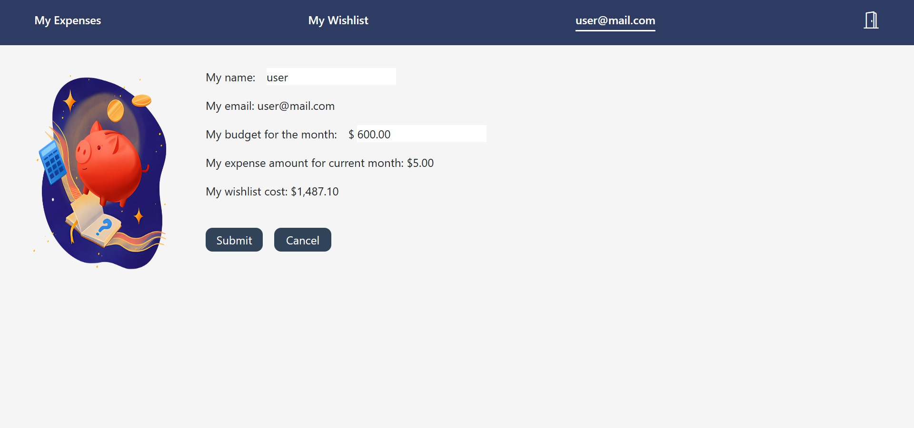

# Wish at your own Expense

### Description

This web application was created as part of my project for General Assembly's Software Engineering Immersive Unit 4 - Data and Backend Development.

It allows users to track their expenses and record their wishlist items; allowing them to see which wishlist items are within their budget to purchase.

### Technologies Used

#### Frontend

- React
- JavaScript
- HTML
- CSS
- Tailwind CSS

#### Backend

- express
- nodemon
- dotenv
- bcrypt
- jsonwebtoken
- uuid
- cors
- express-rate-limit
- helmet
- express-validator
- PostgreSQL
- [pg](https://node-postgres.com/)

### Getting Started

[Wireframe](https://www.figma.com/file/LjzKlypYnWFNhNUUQMzuiM/Wish-at-your-own-Expense?type=design&node-id=0-1&mode=design&t=JcCWPsXHDlRd4KBw-0)

[Public Board](https://github.com/users/odebear27/projects/4)

Clone the repository to your local machine

```
https://github.com/odebear27/wish-at-your-own-expense.git
```

Navigate to the frontend project directory

```
cd wish-at-your-own-expense/frontend
```

Install the project dependencies

```
npm i
```

Set up .env for frontend

| Key         | Comment           |
| ----------- | ----------------- |
| VITE_SERVER | Port for frontend |

Run the frontend

```
npm run dev
```

Navigate to the backend project directory

```
cd ../backend
```

Install the project dependencies

```
npm i
```

Set up .env for backend

| Key            | Comment                       |
| -------------- | ----------------------------- |
| DB_HOST        | Local database connection URL |
| DB_PORT        | Local database port           |
| DB_DATABASE    | Database name                 |
| DB_USER        | Database user                 |
| DB_PW          | Database password             |
| SERVER_PORT    | Port for backend              |
| ACCESS_SECRET  | Secret key for access token   |
| REFRESH_SECRET | Secret key for refresh token  |

Run the backend

```
npm run dev
```

### How to use


Register for a user account and login


View and delete user profile


Update user profile


View my expenses page  
User can add, update or delete an expense item


Add an expense item


Update an expense item


View my wishlist page  
User can add, update, delete a wishlist item; see which item are within their excess budget (indicated by the bell icon)  
Clicking on the url link under Store opens the webpage in a new tab


Add a wishlist item


Update a wishlist item


Register for an admin account and login


Admin can choose what to do


Edit provider profile


View all users with their account status
Admin can delete user account

### Resources

- [PostgreSQL official documentation](https://www.postgresql.org/docs/16)
- [Node postgres official documentation](https://node-postgres.com/apis/pool#poolquery)
- [Using local storage](https://blog.logrocket.com/localstorage-javascript-complete-guide/)
- [Protecting route with react router](https://blog.logrocket.com/authentication-react-router-v6/)

### Attribution

- [Background image](https://www.freepik.com/free-vector/watercolor-christmas-background_20290853.htm#from_view=detail_alsolike)
- [Images in Admin View Page and User Profile Page](https://www.cleanpng.com/)
- [Bootstrap icons](https://icons.getbootstrap.com/)
- [Favicon](https://icons8.com/icon/17361/santa)

### Planned future enhancements

Refer to Ice Box items in [Public Board](https://github.com/users/odebear27/projects/4/views/1)
